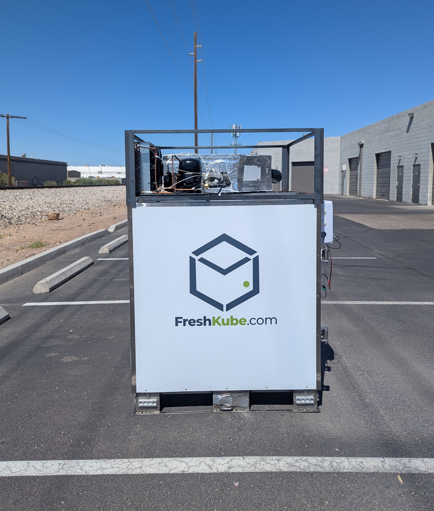
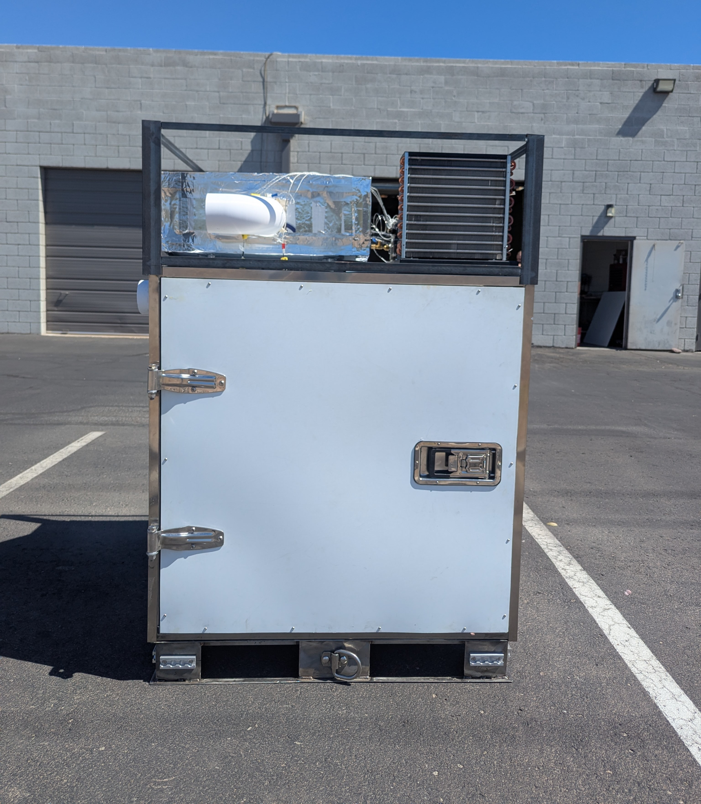

Industrial Engineer specializing in manufacturing operations and mechanical engineering, with experience optimizing production workflows, improving assembly processes, and supporting NPI initiatives. Skilled in SolidWorks, GD&T, DFM/DFA, supply chain, procurement, production planning, and hands-on shop-floor support.

#### Technical Skills: Prototype, NPI, Manufacturing, Design, Supply Chain, Machine Learning 

## Education						       		
- M.S. Industrial Engineering	| Arizona State University
- B.Tech. Mechanical Engineering | Indus University  

## Work Experience
### Operations Research Analyst | Freshkube
Prototyping | Mechanical Design | Suppply Chain | Procurement Plannning | Material Sourcing | NPI | DMF & DMA | Standard Operating Procedures (SOPs) | Root Cause Analysis

### Graduate Services Assistant | Arizona State University
Student Assistent | Mathematical Models | Convex Optimization | MySQL | VBA (Macro) | Producttion Systems | Lean Manuacturing | JIT/Kanban

### CAD Engineer | Cube CAD Center
Software Training | CAD Software (AutoCAD, SolidWorks, Fusion 360, NX, Creo, Solid Edge) | Reverse Engineering | Assembley | Manufacturing | Customer Support

### Supply Chain Manager | Win Industries
Supply Chain | Matierla Procurement | Customer Support | Inventory Contorol (Mechanical & Electrical) | BI Tools | KPIs | Forecasting | Logistics Arrebnetb | Production Schedule | ERP System

### Trainee Engineer | Plasma Induction
Maintenance | Workshop Operaitons | Material Quility Testing | Equiment Reliability | Product Testing | Tools Training

## Projects
### Refrigeration System Design and Manufacturing

#### Prototype 1 (System upgrade and testing)

*This system is designed for small farmers to transport perishable products during the harvesting season, minimizing pre-cooling requirements and reducing transportation time to centralized warehouses.*

#### Prototype 2 (Manufactuing and Testing)

  
  

*This system is designed for the Air Force to meet military standards (MIL-STD) for storing pharmaceutical products while operating reliably in harsh environmental conditions. It features high corrosion resistance, impact-resistant construction, and an advanced insulation system using vacuum insulation panels to ensure thermal efficiency and durability.*

#### Finite Element analysis (FEA)

  
  
  
  

*Different mechanical structural designs were evaluated to identify the most sustainable load condition that meets customer requirements and withstands heavy loads from perishable and pharmaceutical items. This image illustrates the von Mises stress distribution and the corresponding factor of safety.*

#### Fabrication and Welding  

#### Prototype 2 
[Watch the video](/assets/prototype_testing.mp4)

#### Prototype 2 
[Watch the video](/assets/prototype_testing.mp4)

- Led the design and manufacturing of a prototype refrigeration system meeting Air Force standards for pharmaceutical product storage.

- 
- Designed and drafted the refrigeration system structure for pharmaceutical applications using SolidWorks, ensuring compliance with industry standards and optimized performance.
- Supervised design team and mentored 3 trainee engineers in production planning and process monitoring, achieving continuous improvements and maintaining strict quality standards for Air Force standards.
- Led mechanical design and assembly of the first prototype, including system upgrades and performance testing of advanced refrigeration systems, ensuring Air Force quality compliance and operational reliability under demanding conditions.
